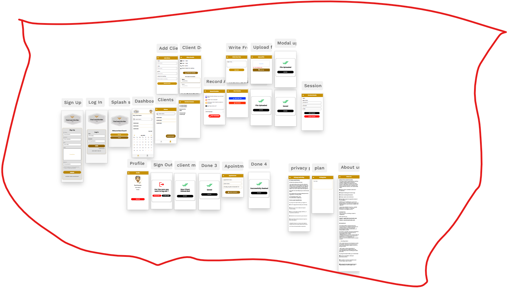

# THE COACH SCRIBE
## Documento maestro de producto, diseño y construcción

**Versión:** 1.0  
**Fecha:** 19 de julio de 2026  
**Propietario del producto:** Mobashil Group S.A.  
**Dominio principal:** thecoachscribe.com  
**Aplicación:** app.thecoachscribe.com  
**Nombre anterior:** CoRecap  
**Estado:** Especificación integral para reconstrucción mediante IA o equipo de desarrollo

---

## Índice general

0. Cómo debe usarse este documento  
1. Resumen ejecutivo  
2. Problema que resuelve  
3. Visión del producto  
4. Usuarios y roles  
5. Principios obligatorios de experiencia  
6. Identidad visual  
7. Plataformas  
8. Flujo principal de principio a fin  
9. Mapa completo de pantallas  
10. Especificación detallada de pantallas del coach  
11. Portal del cliente  
12. Sitio público  
13. Planes, límites y monetización  
14. Motor de inteligencia artificial  
15. Grabación, transcripción y diarización  
16. Modelo de datos  
17. Estados y máquinas de flujo  
18. API requerida  
19. Arquitectura técnica recomendada  
20. Estructura de archivos del proyecto  
21. Variables de entorno  
22. Integraciones  
23. Idiomas e internacionalización  
24. Privacidad, seguridad y cumplimiento  
25. Notificaciones  
26. Administración interna  
27. Analítica del producto  
28. Errores y recuperación  
29. Pruebas obligatorias  
30. Criterios de aceptación  
31. Fases de construcción  
32. Inventario del prototipo anterior  
33. Material de diseño existente  
34. Decisiones que deben quedar configurables  
35. Entregables del equipo o IA constructora  
36. Prompt maestro para entregar a una IA constructora  
37. Conclusión

---

## 0. Cómo debe usarse este documento

Este documento reúne en una sola especificación todo lo definido para The Coach Scribe: la idea original, la evolución del producto, las pantallas, los flujos, las funciones, los archivos, la arquitectura, los datos, la inteligencia artificial, los pagos, los idiomas, la privacidad y los criterios para aceptar el trabajo.

La IA o el equipo que construya la aplicación debe tomar este documento como fuente principal. Cuando una decisión histórica cambió con el tiempo, se aplica esta clasificación:

- **REQUERIDO:** debe existir y funcionar en la versión de producción.
- **CONFIGURABLE:** debe poder cambiarse desde administración o variables de entorno, sin rehacer la aplicación.
- **FASE 2:** no bloquea el MVP, pero la arquitectura debe permitir agregarlo.
- **LEGADO:** existió en un prototipo anterior. Se conserva como referencia, pero no debe copiarse ciegamente.
- **POR DEFINIR:** no debe inventarse. Debe dejarse configurable o marcado para decisión comercial.

Regla principal: no entregar una maqueta con botones falsos. Toda función visible debe funcionar, mostrar un estado claro o estar explícitamente identificada como “Próximamente” desde una configuración administrable.

---

## 1. Resumen ejecutivo

The Coach Scribe es una plataforma con inteligencia artificial creada para coaches, consultores, mentores y profesionales que realizan sesiones individuales o grupales. Su función es convertir una conversación de coaching en documentación útil y ordenada sin obligar al coach a pasar horas escribiendo después de cada sesión.

El sistema permite:

1. Crear y administrar clientes.
2. Obtener consentimiento antes de grabar.
3. Grabar una sesión, subir un audio, cargar un archivo, tomar una foto o escribir texto libre.
4. Transcribir la conversación y separar a los participantes.
5. Generar con IA un resumen estructurado.
6. Detectar temas, emociones expresadas, obstáculos, fortalezas, metas, compromisos y tareas.
7. Permitir que el coach revise, edite y apruebe el contenido.
8. Guardar el historial completo por cliente.
9. Exportar, imprimir, compartir o enviar únicamente la información aprobada.
10. Dar al cliente un portal privado con resúmenes compartidos, tareas, notas, mensajes y citas.
11. Preparar respuestas sugeridas por IA para que el coach las revise, sin responder automáticamente al cliente.
12. Integrarse con Google Calendar, Google Drive, pagos y notificaciones.
13. Funcionar en varios idiomas y soportar idiomas de derecha a izquierda.

La IA es un asistente administrativo y de análisis. No reemplaza el criterio profesional del coach, no diagnostica condiciones médicas o psicológicas y no comparte información sin aprobación humana.

---

## 2. Problema que resuelve

Después de una sesión, el coach suele necesitar:

- recordar lo conversado;
- organizar notas sueltas;
- identificar compromisos y tareas;
- preparar la próxima sesión;
- enviar un resumen al cliente;
- registrar evolución durante semanas o meses;
- encontrar rápidamente información antigua;
- facturar, agendar o dar seguimiento.

Ese trabajo puede tomar entre varios minutos y una hora adicional por cliente. También existe el riesgo de perder detalles importantes, mezclar clientes, dejar tareas sin seguimiento o guardar información sensible en lugares inseguros.

The Coach Scribe centraliza ese trabajo en un flujo simple:

**Sesión → transcripción → análisis de IA → revisión del coach → historial → seguimiento.**

---

## 3. Visión del producto

### 3.1 Promesa principal

“Concentrate en la transformación de tu cliente. The Coach Scribe se ocupa de documentar, ordenar y preparar el seguimiento.”

### 3.2 Diferenciadores

- Diseñado específicamente para coaching, no como una grabadora genérica.
- Convierte conversaciones en acciones concretas.
- Historial longitudinal por cliente.
- Detección de metas, tareas, bloqueos, fortalezas y preguntas de reflexión.
- Revisión humana obligatoria antes de compartir.
- Portal del cliente conectado con el proceso de coaching.
- Multilingüe desde la base.
- Posibilidad de uso desde app, web y enlaces enviados por WhatsApp.
- Automatización sin perder el control profesional del coach.
- Marca profesional global, respaldada por Mobashil Group S.A.

### 3.3 Qué no es

- No es una aplicación clínica.
- No realiza diagnósticos psicológicos.
- No debe prometer precisión absoluta de emociones o intenciones.
- No reemplaza notas profesionales obligatorias por ley.
- No graba en secreto.
- No debe enviar respuestas automáticas al cliente sin autorización del coach.
- No debe almacenar audio indefinidamente por defecto.

---

## 4. Usuarios y roles

### 4.1 Coach

Usuario principal y cliente de pago. Puede:

- crear y editar clientes;
- iniciar o cargar sesiones;
- registrar consentimientos;
- revisar transcripciones y resúmenes;
- editar y aprobar contenido;
- crear tareas y metas;
- compartir contenido con el cliente;
- recibir mensajes y notas urgentes;
- gestionar citas, pagos e integraciones;
- exportar datos;
- configurar idioma, marca y retención.

### 4.2 Cliente del coach

Accede mediante invitación, enlace único o cuenta. Puede ver únicamente lo que el coach decidió compartir. Puede:

- ver resúmenes aprobados;
- ver y actualizar tareas asignadas;
- escribir notas o preguntas;
- marcar una nota como urgente;
- reservar una cita si está habilitado;
- realizar un pago si está habilitado;
- descargar documentos compartidos;
- administrar su consentimiento y solicitar acceso o eliminación de datos.

### 4.3 Administrador de organización

Para academias, empresas de coaching o equipos. Puede:

- invitar coaches;
- asignar licencias;
- ver uso agregado;
- administrar facturación;
- definir marca y políticas comunes;
- configurar límites, retención e integraciones;
- nunca debe leer contenido privado de sesiones salvo permiso legal y configuración explícita.

### 4.4 Administrador de plataforma

Equipo interno de The Coach Scribe. Puede:

- gestionar planes y precios;
- ver estado técnico de trabajos;
- resolver pagos y suscripciones;
- administrar traducciones y parámetros;
- ver métricas operativas sin exponer contenido sensible;
- suspender cuentas por abuso;
- atender solicitudes de privacidad;
- revisar registros de auditoría.

### 4.5 Soporte

Rol limitado. Puede ver datos de cuenta y diagnóstico técnico, pero no el contenido de sesiones por defecto. Todo acceso excepcional debe registrarse.

---

## 5. Principios obligatorios de experiencia

1. **Muy fácil de usar:** una persona no técnica debe poder crear un cliente e iniciar una sesión sin capacitación.
2. **Móvil primero:** las acciones principales deben funcionar cómodamente en teléfono.
3. **Serio y profesional:** no debe parecer una app infantil ni experimental.
4. **Pocos pasos:** el flujo principal debe completarse con la menor cantidad posible de pantallas.
5. **Estados claros:** grabando, subiendo, transcribiendo, procesando, listo, error y reintento.
6. **Nada se pierde:** una interrupción, llamada o caída de internet no debe borrar una grabación.
7. **Control del coach:** la IA propone; el coach decide.
8. **Privacidad visible:** consentimiento, retención y eliminación deben ser fáciles de entender.
9. **Multilingüe real:** no solo traducir botones; también transcripción, análisis, correos y documentos.
10. **Accesibilidad:** contraste suficiente, texto legible, áreas táctiles grandes, navegación por teclado y lectores de pantalla.

---

## 6. Identidad visual

### 6.1 Dirección de marca actual

El mapa de pantallas más reciente usa una imagen de marca premium:

- fondos negros o azul muy oscuro;
- blanco como fondo principal de formularios;
- dorado como color de énfasis;
- tarjetas limpias;
- fotografías profesionales de coaches;
- botones amplios y redondeados;
- tipografía elegante para títulos y simple para contenido.

Esta dirección debe prevalecer en la aplicación autenticada.

### 6.2 Paleta recomendada

- Negro carbón: `#111111`
- Azul noche: `#14213D`
- Dorado principal: `#D5A640`
- Dorado claro: `#F1D58A`
- Blanco: `#FFFFFF`
- Fondo suave: `#F7F7F5`
- Gris texto: `#5F6368`
- Éxito: `#198754`
- Advertencia: `#C98100`
- Error: `#C62828`

El prototipo anterior usaba índigo y violeta (`#4F46E5`) y una landing con coral `#FF6B6B`, navy `#274C77` y azul suave `#E8EFF9`. Esos colores son **LEGADO**. Pueden conservarse solamente si el kit final de marca los recupera, pero no deben mezclarse sin criterio con el diseño dorado actual.

### 6.3 Tipografía

- Títulos de marca: Playfair Display o equivalente serif elegante.
- Interfaz: Inter, Arial o sistema sans serif.
- Tamaño mínimo móvil recomendado: 16 px en campos y 14 px en textos secundarios.

### 6.4 Logo y firma

Mostrar:

**The Coach Scribe**  
*Powered by Mobashil Group S.A.*

El producto debe sentirse independiente, pero respaldado por la empresa madre.

---

## 7. Plataformas

### 7.1 Aplicación móvil

**REQUERIDO:** iOS y Android desde un mismo código base, preferentemente Flutter. Debe tener acceso nativo al micrófono, almacenamiento temporal seguro, notificaciones y manejo de interrupciones.

### 7.2 Aplicación web del coach

**REQUERIDO:** escritorio y móvil. Debe permitir revisar sesiones, editar resúmenes, administrar clientes, tareas, planes, pagos e integraciones con más comodidad que el teléfono.

### 7.3 Portal web del cliente

**REQUERIDO para Fase 2:** acceso por cuenta o enlace seguro. Debe ser simple, sin mostrar herramientas internas del coach.

### 7.4 Sitio público

**REQUERIDO:** landing profesional en `thecoachscribe.com`, con información, planes, preguntas frecuentes, contacto y acceso a la app.

### 7.5 WhatsApp

**FASE 2 / CANAL COMPLEMENTARIO:** el concepto original era “WhatsApp-first”. WhatsApp puede usarse para enviar invitaciones, recordatorios, enlaces a tareas o resúmenes y avisos. La información sensible no debe enviarse completa por WhatsApp por defecto. El sistema principal debe funcionar aunque WhatsApp no esté disponible.

---

## 8. Flujo principal de principio a fin

### 8.1 Primera entrada

1. El coach abre la app o web.
2. Ve Splash/Welcome.
3. Elige crear cuenta o iniciar sesión.
4. Se registra con Google, Apple o email.
5. Verifica email cuando corresponde.
6. Acepta términos y privacidad.
7. Completa nombre, profesión, zona horaria, idioma y país.
8. Elige si trabaja solo o en organización.
9. Ve una explicación corta de cómo funciona.
10. Llega al Dashboard.

### 8.2 Crear cliente

1. Coach selecciona “Add Client”.
2. Ingresa nombre y al menos un medio de contacto.
3. Puede agregar teléfono, email, idioma, zona horaria, etiquetas y notas privadas.
4. Decide si invita al portal ahora o más adelante.
5. El sistema crea la ficha.
6. Muestra confirmación “New Client Onboarded”.

### 8.3 Iniciar sesión de coaching

1. Desde Dashboard o ficha del cliente, coach selecciona “New Session”.
2. Elige cliente.
3. Elige método de entrada:
   - Grabar audio en vivo.
   - Subir audio o video.
   - Subir documento.
   - Tomar o subir foto.
   - Escribir texto libre.
4. Si va a grabar, aparece consentimiento.
5. El coach confirma que informó al cliente y registra su aceptación.
6. Aparece preparación de sesión.
7. Comienza grabación.
8. Puede marcar Insight, Task o Goal durante la conversación.
9. Finaliza la sesión.
10. La app asegura que el archivo terminó de subir.
11. Se ejecuta transcripción.
12. Se ejecuta análisis de IA.
13. El coach recibe notificación cuando está listo.
14. Abre la sesión, revisa y edita.
15. Aprueba el resumen.
16. Guarda en el historial.
17. Decide qué compartir con el cliente.
18. Puede crear una cita de seguimiento y tareas.

### 8.4 Mensaje del cliente

1. Cliente escribe una nota o pregunta en su portal.
2. Puede marcar “Urgent”.
3. Sistema notifica al coach.
4. Sistema recupera las últimas dos o tres sesiones aprobadas del mismo cliente, respetando permisos.
5. IA genera un borrador de respuesta para el coach.
6. El coach puede aprobar, editar, ignorar o redactar desde cero.
7. Solo después de la acción del coach se envía al cliente.

---

## 9. Mapa completo de pantallas

La aplicación debe contener como mínimo las siguientes pantallas o equivalentes funcionales.

### 9.1 Autenticación y entrada

1. Splash / Welcome Back Coach.
2. Sign Up.
3. Log In.
4. Forgot Password.
5. Email Verification.
6. Create New Password.
7. Terms and Privacy acceptance.
8. Onboarding inicial.
9. Selección de idioma.

### 9.2 Área del coach

10. Dashboard.
11. Clients.
12. Add Client.
13. Client Details.
14. Edit Client.
15. Previous Sessions / Session History.
16. Session Preview.
17. New Session.
18. Select Input Method.
19. Recording Consent.
20. Session Preparation.
21. Record Audio.
22. Upload File.
23. File Uploaded confirmation.
24. Write Free Text.
25. Add Photo / Camera.
26. Processing.
27. Session Details / AI Review.
28. Edit Transcript.
29. Edit Summary.
30. Share Summary.
31. Export.
32. Tasks and Goals.
33. Appointments.
34. Successfully Booked.
35. Notifications.
36. Search.
37. Profile.
38. Settings.
39. Integrations.
40. Subscription / Pricing Plan.
41. Billing History.
42. Privacy and Policy.
43. Terms of Service.
44. Data and Retention.
45. Sign Out confirmation.

### 9.3 Portal del cliente

46. Client Welcome / invitation.
47. Client Login or magic link.
48. Client Home.
49. Shared Session Summaries.
50. Summary Detail.
51. Weekly Tasks.
52. Task Detail / completion.
53. Notes and Questions.
54. New Note with Urgent flag.
55. Appointments.
56. Payments.
57. Shared Files.
58. Client Profile and Privacy.

### 9.4 Administración

59. Admin Login.
60. Admin Overview.
61. Users and Organizations.
62. Plans and Limits.
63. Subscriptions and Payments.
64. Processing Jobs.
65. Failed Jobs / Retry.
66. Usage and Cost Dashboard.
67. Translation Management.
68. Templates and AI Prompts.
69. Notifications and Email Templates.
70. Audit Logs.
71. Privacy Requests.
72. Feature Flags.
73. Support Tools.

### 9.5 Modales y estados

74. Saved.
75. New Client Onboarded.
76. Delete confirmation.
77. Consent not completed.
78. Usage limit reached.
79. Upgrade required.
80. Offline.
81. Upload paused.
82. Upload resumed.
83. Transcription failed.
84. AI processing failed.
85. Payment failed.
86. Permission denied.
87. Session shared successfully.
88. Invitation sent.

---

## 10. Especificación detallada de pantallas del coach

### 10.1 Splash / Welcome

**Objetivo:** presentar marca y decidir si el usuario entra automáticamente o debe autenticarse.

**Elementos:** logo, nombre, “Powered by Mobashil Group S.A.”, indicador corto de carga.

**Lógica:**

- si existe sesión válida, ir al Dashboard;
- si no existe, ir a Log In;
- si es primer uso, mostrar onboarding;
- no dejar la pantalla bloqueada más de unos segundos;
- ante error de configuración, mostrar mensaje útil y opción de reintento.

### 10.2 Sign Up

**Campos:** nombre, apellido, email, contraseña, confirmación, país, zona horaria, idioma, checkbox de términos y privacidad.

**Opciones:** Google, Apple y email.

**Validaciones:** email válido, contraseña segura, checkbox obligatorio, email no duplicado. Nunca informar si una cuenta existe de manera que facilite ataques; usar mensajes neutrales.

**Acciones:** Create Account, Log In, Terms, Privacy.

### 10.3 Log In

**Campos:** email y contraseña.

**Acciones:** Log In, Google, Apple, Forgot Password, Create Account.

**Estados:** cargando, credenciales incorrectas, cuenta suspendida, email no verificado, demasiados intentos.

### 10.4 Onboarding

Máximo cinco pasos:

1. Qué hace The Coach Scribe.
2. Crear primer cliente.
3. Cómo se obtiene consentimiento.
4. Cómo funciona la IA y la revisión humana.
5. Integraciones opcionales.

Debe poder omitirse y abrirse luego desde Ayuda.

### 10.5 Dashboard

**Objetivo:** mostrar en una sola vista qué necesita atención.

**Contenido:**

- saludo con nombre del coach;
- botón grande “New Session”;
- clientes recientes;
- sesiones recientes;
- sesiones procesándose;
- resúmenes pendientes de revisión;
- tareas vencidas o próximas;
- próximos appointments;
- mensajes de clientes, destacando urgentes;
- consumo del plan;
- acceso a Clients, Sessions, Tasks, Calendar y Profile.

**Acciones rápidas:** Add Client, Record Session, Upload File, Write Notes, Invite Client.

**Estados vacíos:** explicar el primer paso, no mostrar una pantalla desierta.

### 10.6 Clients

**Elementos:** búsqueda, filtros, etiquetas, orden por nombre/última sesión/próxima cita, botón Add Client.

Cada tarjeta muestra:

- nombre;
- avatar o iniciales;
- última sesión;
- próxima cita;
- tareas abiertas;
- indicador de mensaje urgente;
- estado de invitación al portal.

**Privacidad:** solamente clientes pertenecientes al coach u organización autorizada.

### 10.7 Add Client

**Campos requeridos:** nombre.

**Campos opcionales:** apellido, email, teléfono, idioma preferido, zona horaria, país, pronombre opcional, etiquetas, objetivo general, notas privadas, fecha de inicio, frecuencia prevista.

**Opciones:**

- Send portal invitation now.
- Allow appointment booking.
- Allow payments.
- Import from CSV/contact list.

No se debe obligar a tener email si el coach quiere empezar solo con un nombre, pero para portal o notificaciones sí se necesita un canal válido.

### 10.8 Client Details

**Cabecera:** nombre, contacto, etiquetas, editar, nueva sesión, invitar al portal.

**Pestañas:**

- Overview.
- Sessions.
- Tasks and Goals.
- Messages.
- Appointments.
- Files.
- Payments.
- Private Notes.
- Consent and Privacy.

**Overview:** resumen de relación, última sesión, próximos compromisos, progreso, temas recurrentes aprobados, sin presentar conclusiones clínicas.

### 10.9 Previous Sessions / Session History

Lista legible, no códigos ni URLs. Cada registro debe mostrar:

- título;
- fecha y hora;
- duración;
- cliente;
- idioma;
- método de entrada;
- estado;
- resumen disponible;
- tareas creadas;
- estado compartido/no compartido.

**Filtros:** cliente, fecha, estado, idioma, etiqueta, método de entrada.

**Acciones:** abrir, duplicar estructura, exportar, compartir, archivar, eliminar.

### 10.10 New Session / Select Input Method

Mostrar tarjetas claras:

1. Record Audio.
2. Upload Audio or Video.
3. Upload Document.
4. Write Free Text.
5. Add Photo.

Antes de continuar se elige cliente y, opcionalmente, título, tipo de sesión e idioma. El idioma puede detectarse automáticamente, pero el coach puede fijarlo.

### 10.11 Recording Consent

**REQUERIDO antes de activar el micrófono.**

Mostrar:

- que la conversación será grabada y transcrita;
- para qué se usa;
- qué proveedor de IA puede procesarla según la política;
- que el audio se elimina luego del procesamiento según la configuración;
- que el coach es responsable de conocer las leyes locales;
- que algunas jurisdicciones exigen consentimiento de todas las partes;
- enlace a privacidad y términos.

**Registro mínimo:** fecha/hora, coach, cliente, sesión, método de consentimiento, versión del texto legal, IP/dispositivo cuando corresponda.

**Métodos:**

- checkbox confirmado por el coach;
- firma o aceptación en pantalla del cliente;
- consentimiento previo guardado y todavía vigente;
- enlace remoto de aceptación.

El botón Continue permanece deshabilitado hasta completar el consentimiento.

### 10.12 Session Preparation

Checklist:

- activar “Do Not Disturb”;
- tener batería suficiente o conectar cargador;
- buena conexión;
- lugar tranquilo;
- verificar micrófono;
- no usar modo avión;
- confirmar idioma;
- mostrar espacio disponible y límite del plan.

Botones Cancel y Ready.

### 10.13 Record Audio

**Elementos obligatorios:**

- indicador rojo de grabación;
- temporizador;
- nombre del cliente;
- idioma detectado;
- calidad/conexión;
- nivel de micrófono;
- pausar y continuar;
- finalizar;
- botones Insight, Task y Goal;
- mensaje de guardado seguro;
- transcripción en vivo cuando sea técnicamente confiable.

**Comportamiento técnico:**

- grabar por fragmentos cifrados;
- guardar cada fragmento localmente hasta recibir confirmación del servidor;
- reintentar automáticamente;
- continuar aunque la pantalla se bloquee, dentro de límites del sistema operativo;
- manejar llamada entrante, cambio de red y cierre accidental;
- avisar si la app ya no puede grabar;
- no mostrar “guardado” antes de confirmar integridad;
- límite inicial recomendado: 60 minutos, configurable por plan.

### 10.14 Upload File

Admitir:

- audio: MP3, M4A, WAV, AAC, OGG;
- video: MP4, MOV, WEBM, extrayendo audio;
- documentos: PDF, DOCX, TXT;
- imágenes: JPG, PNG, HEIC.

**Validaciones:** tipo, tamaño, duración, malware, archivo corrupto, cuota disponible.

**UX:** barra de progreso, pausa/reanudación, cancelación, confirmación “File Uploaded”.

### 10.15 Write Free Text

Editor simple para notas tomadas fuera de la app.

**Campos:** cliente, título, fecha, idioma, texto, etiquetas.

**Acciones:** Save Draft, Generate Summary, Cancel.

La IA debe distinguir que el contenido proviene de notas del coach, no de una transcripción literal.

### 10.16 Add Photo

Permite fotografiar notas manuscritas, pizarra o documento. Debe:

- pedir permiso de cámara;
- recortar/rotar;
- mejorar legibilidad sin alterar contenido;
- extraer texto;
- mostrar el texto detectado para corrección;
- conservar o eliminar la imagen según retención.

### 10.17 Processing

Una pantalla o estado persistente que muestre etapas reales:

1. Uploading.
2. Verifying file.
3. Transcribing.
4. Identifying speakers.
5. Generating summary.
6. Extracting tasks and goals.
7. Ready for review.

El usuario puede salir de la pantalla. El trabajo continúa en servidor y se notifica al terminar.

### 10.18 Session Details / AI Review

Es la pantalla central del producto.

**Cabecera:** cliente, fecha, duración, idioma, estado, botones Save, Approve, Share y More.

**Secciones editables:**

1. Executive Summary.
2. Main Topics.
3. Expressed Emotions.
4. Obstacles or Concerns.
5. Strengths and Resources.
6. Goals.
7. Action Items.
8. Recommendations for Follow-up.
9. Reflection Questions.
10. Coach Private Notes.
11. Markers with timestamps.
12. Transcript.
13. Attachments.
14. AI uncertainties or items requiring confirmation.

**Reglas:**

- cada campo puede editarse;
- cambios se guardan con versión;
- coach puede regenerar solo una sección;
- mostrar claramente qué fue generado por IA;
- no compartir notas privadas ni transcript por defecto;
- antes de compartir, presentar una vista previa exacta;
- aprobación humana obligatoria.

### 10.19 Transcript Editor

Mostrar segmentos por participante y tiempo:

- Speaker 1 / Coach.
- Speaker 2 / Client.
- Speaker 3, etc.

Permitir renombrar hablantes, corregir texto, buscar, ir a timestamp y marcar fragmentos. La edición de transcript debe poder recalcular el resumen sin perder la versión anterior.

### 10.20 Tasks and Goals

Vista global y por cliente.

Cada tarea contiene:

- título;
- descripción;
- responsable: coach o cliente;
- fecha límite;
- estado: pending, in progress, completed, skipped;
- prioridad;
- origen: sesión y timestamp;
- visibilidad: privada o compartida;
- recordatorios.

Las metas tienen nombre, descripción, fecha objetivo, indicadores de avance, notas y sesiones relacionadas.

### 10.21 Share Summary

El coach selecciona exactamente qué se comparte:

- resumen;
- temas;
- tareas;
- metas;
- preguntas;
- archivos;
- transcript, desactivado por defecto;
- notas privadas, nunca seleccionables salvo conversión explícita a nota compartida.

Canales:

- portal;
- email;
- enlace seguro con vencimiento;
- PDF;
- WhatsApp como enlace, no como texto sensible completo por defecto.

### 10.22 Export

Formatos:

- PDF profesional;
- DOCX;
- TXT;
- CSV para tareas o historial;
- JSON para portabilidad;
- impresión.

El PDF puede incluir marca del coach en planes con white-label. Debe indicar fecha, cliente, coach y aviso de confidencialidad.

### 10.23 Appointments

Campos:

- cliente;
- título;
- fecha;
- hora;
- duración;
- zona horaria;
- modalidad;
- enlace de videollamada;
- ubicación;
- recordatorios;
- notas privadas.

Sincronizar con Google Calendar cuando esté conectado. Mostrar confirmación “Successfully Booked”.

### 10.24 Profile

Datos del coach, foto, bio, especialidad, idiomas, país, zona horaria, marca, firma de email, enlaces y preferencias.

### 10.25 Settings

Secciones:

- Account.
- Language and Region.
- Notifications.
- Recording and Consent.
- AI Preferences.
- Data Retention.
- Integrations.
- Subscription and Billing.
- Brand Kit.
- Security.
- Privacy Requests.
- Help.
- App Version.
- Sign Out.

### 10.26 Pricing Plan / Subscription

Mostrar plan actual, uso, límites, próxima factura, método de pago, upgrade/downgrade/cancelación y facturas. No ocultar condiciones de renovación.

### 10.27 Privacy and Policy

Texto legal real y actualizado, no el texto de demostración de 2023. Debe incluir recopilación, finalidad, proveedores, retención, derechos, seguridad, transferencias internacionales, contacto y fecha de actualización.

---

## 11. Portal del cliente

### 11.1 Acceso

Opciones:

- invitación por email;
- magic link de un solo uso;
- cuenta con contraseña;
- Google/Apple si se habilita.

El enlace debe vencer y no incluir datos sensibles en la URL.

### 11.2 Client Home

Mostrar:

- próximo appointment;
- tareas de esta semana;
- último resumen compartido;
- mensajes nuevos;
- botón “Ask or leave a note”;
- pagos pendientes si están habilitados.

### 11.3 Shared Summaries

Solo versiones aprobadas y compartidas. El cliente no debe ver borradores, prompts, costos, transcript completo ni notas privadas.

### 11.4 Weekly Tasks

El cliente puede marcar avance y agregar comentario. El coach ve el cambio. Debe conservarse historial de estados.

### 11.5 Notes and Questions

Formulario con texto, adjunto opcional y checkbox “Urgent”. Debe explicar que urgente no reemplaza servicios de emergencia.

### 11.6 Borrador de respuesta con IA

Al recibir un mensaje:

1. validar que cliente y coach estén vinculados;
2. recuperar contexto permitido de las últimas dos o tres sesiones;
3. eliminar información que no sea necesaria;
4. enviar contexto y mensaje al modelo;
5. guardar la sugerencia como borrador;
6. notificar al coach;
7. permitir Approve, Edit, Ignore;
8. nunca enviar automáticamente.

### 11.7 Payments

Opcional por coach. Mostrar concepto, importe, moneda, estado, recibo y botón de pago seguro. No almacenar datos completos de tarjeta.

### 11.8 Privacy

Cliente puede consultar consentimientos, descargar datos compartidos, retirar consentimiento futuro y solicitar acceso o eliminación. Retirar consentimiento no debe borrar registros que legalmente deban conservarse, pero debe detener usos no obligatorios.

---

## 12. Sitio público

### 12.1 Home

Secciones:

- hero con promesa principal;
- cómo funciona en tres pasos;
- beneficios;
- funciones;
- seguridad y privacidad;
- idiomas;
- testimonios verificados;
- planes;
- FAQ;
- CTA para prueba;
- acceso a app.

### 12.2 How It Works

1. Record or upload.
2. AI organizes the session.
3. Review, approve and follow up.

### 12.3 Features

Grabación, transcripción, resúmenes, tareas, historial, portal, idiomas, integraciones, exportación y marca.

### 12.4 Plans

Tarjetas editables desde CMS o administración. No hardcodear precios en múltiples archivos.

### 12.5 About Us

Texto base:

“The Coach Scribe is an AI-powered assistant platform built for coaches and consultants. It was born from the real needs and guidance of dozens of coaches who wanted to focus on transformation rather than administration. The platform records, transcribes, summarizes and organizes coaching sessions, turning conversations into clear follow-up actions. The Coach Scribe is a product of Mobashil Group S.A., headquartered in Panama City, Panama.”

### 12.6 Contact

Formulario, email de soporte, ventas y política anti-spam.

### 12.7 Idiomas del sitio

Inglés como idioma principal, con español, portugués, italiano, francés, hebreo y otros idiomas habilitados. La estructura debe estar lista para árabe y RTL.

---

## 13. Planes, límites y monetización

Las decisiones comerciales cambiaron durante el desarrollo. Por eso el sistema debe usar un **motor de planes configurable**. Los nombres, precios, monedas, límites y funciones se guardan en base de datos y administración.

### 13.1 Lanzamiento simplificado recomendado

- **Free Trial:** 3 sesiones totales gratuitas para probar el flujo completo.
- **Starter:** plan de entrada para coaches independientes.
- **Pro:** plan profesional con mayor uso y portal del cliente.

Los precios finales de Starter y Pro deben cargarse desde administración.

### 13.2 Catálogo completo histórico que debe poder soportarse

| Plan | Límite histórico conocido | Precio histórico conocido | Notas |
|---|---:|---:|---|
| Free | 2 sesiones por mes | USD 0 | En otra versión se definieron 3 sesiones totales de prueba. Configurable. |
| Starter | 10 sesiones por mes | USD 29/mes | Entrada profesional. |
| Standard | 24 sesiones por mes | USD 59/mes | Más automatizaciones e integraciones. |
| Premium | 40 sesiones por mes | USD 99/mes | White-label y marca del coach. |
| Elite | 100 sesiones por mes | Por definir | Uso alto, prioridad y funciones avanzadas. |
| Enterprise / Academy | Personalizado | Cotización | Equipos, licencias, administración y SSO futuro. |

### 13.3 Modelo antiguo por cantidad de clientes

Existió una versión **LEGADO**:

- Basic USD 9, inicialmente 5 clientes y luego corregido a 3.
- Pro USD 29, inicialmente 30 y luego corregido a 20.
- Premium USD 59, clientes ilimitados.

No implementar este modelo como definitivo, pero la arquitectura de límites debe soportar sesiones, minutos, almacenamiento, cantidad de clientes, miembros, idiomas y funciones.

### 13.4 Funciones potenciales por plan

- Free: flujo básico, límites bajos, exportación estándar.
- Starter: más sesiones, tareas y plantillas.
- Standard: integraciones, seguimiento avanzado, importación CSV y reportes.
- Premium: brand kit, white-label, portal bilingüe, PDFs con marca y widgets.
- Elite: alto volumen, soporte prioritario, automatizaciones y analítica avanzada.
- Enterprise: organizaciones, permisos, SSO, políticas y facturación central.

### 13.5 Reglas de consumo

- Una sesión se descuenta cuando entra correctamente en procesamiento, no al tocar Record.
- Un trabajo fallido por error del sistema no consume cuota.
- Reprocesar por cambios pequeños puede tener un límite separado.
- Mostrar consumo antes de alcanzar el límite.
- Al alcanzar límite, no perder información ya grabada. Permitir guardar y solicitar upgrade.
- Webhooks de pago deben ser idempotentes para evitar doble acreditación.

---

## 14. Motor de inteligencia artificial

### 14.1 Objetivos

La IA debe transformar texto o transcripción en una salida estructurada y editable. No debe producir un párrafo genérico.

### 14.2 Entrada

- transcript completo;
- idioma;
- hablantes;
- timestamps;
- marcadores manuales;
- notas del coach;
- tipo de sesión;
- contexto permitido de sesiones anteriores;
- preferencias de estilo del coach.

### 14.3 Salida estructurada

La API debe devolver JSON validable con al menos:

```json
{
  "summary": "...",
  "topics": ["..."],
  "expressed_emotions": [
    {"label": "...", "evidence": "...", "confidence": 0.0}
  ],
  "obstacles": ["..."],
  "strengths": ["..."],
  "goals": [
    {"title": "...", "description": "...", "target_date": null}
  ],
  "action_items": [
    {
      "title": "...",
      "owner": "client",
      "due_date": null,
      "source_timestamp": "00:18:30"
    }
  ],
  "recommendations": ["..."],
  "reflection_questions": ["..."],
  "key_quotes": [
    {"text": "...", "speaker": "client", "timestamp": "00:10:12"}
  ],
  "uncertainties": ["..."],
  "safety_flags": []
}
```

### 14.4 Reglas del prompt

- No inventar información no presente.
- Separar hechos, inferencias e incertidumbres.
- Citar timestamps cuando sea posible.
- Usar lenguaje profesional, cálido y no clínico.
- No diagnosticar.
- No presentar emoción detectada como certeza; usar “expresó”, “pareció mencionar” o nivel de confianza.
- No escribir instrucciones peligrosas.
- Mantener nombres y datos únicamente cuando el coach tenga permiso.
- Producir contenido en el idioma elegido por el coach, que puede ser distinto del idioma hablado.
- Devolver JSON que cumpla el esquema. Si falla, reintentar con reparación controlada.

### 14.5 Revisión humana

Todo resumen queda en estado `review_required`. El coach puede:

- editar;
- regenerar una sección;
- comparar versiones;
- aprobar;
- rechazar;
- guardar como borrador;
- compartir después de aprobar.

### 14.6 Modelos

La implementación más reciente contempló OpenAI para análisis y Deepgram para transcripción con diarización. Un prototipo antiguo mencionaba Gemini, AssemblyAI y Make.com. Estos proveedores deben estar detrás de una capa de abstracción para poder cambiar sin rehacer la app.

---

## 15. Grabación, transcripción y diarización

### 15.1 Requisitos de grabación

- audio estable hasta 60 minutos inicialmente;
- límite configurable por plan;
- formato comprimido de buena calidad;
- fragmentos de 15 a 60 segundos;
- checksum por fragmento;
- cola local cifrada;
- reanudación de subida;
- control de micrófono;
- pausa y reanudación;
- recuperación ante cierre;
- indicador de almacenamiento y batería;
- no perder audio por falla de IA.

### 15.2 Transcripción

- streaming opcional para texto en vivo;
- procesamiento final de mayor calidad al terminar;
- detección de idioma;
- puntuación y párrafos;
- timestamps;
- palabras con confianza baja;
- vocabulario personalizado: nombres, empresas y términos del coach;
- soporte multilingüe;
- reintentos y proveedor alternativo cuando se configure.

### 15.3 Diarización

Separar Coach, Client y otros participantes. Al finalizar, pedir al coach confirmar quién es cada speaker cuando la confianza sea baja.

### 15.4 Audio y retención

Por defecto:

1. audio cifrado se conserva solamente mientras se transcribe y valida;
2. al completar transcript y controles, se programa eliminación;
3. el coach puede elegir retención corta si la ley y el plan lo permiten;
4. el transcript se conserva 30 o 90 días según configuración, o hasta eliminación manual/contractual;
5. toda eliminación queda registrada.

La política exacta debe ser configurable y explicada al usuario.

---

## 16. Modelo de datos

### 16.1 Entidades principales

#### users

- id
- email
- password_hash o proveedor OAuth
- first_name
- last_name
- locale
- timezone
- country
- status
- email_verified_at
- created_at
- updated_at

#### organizations

- id
- name
- slug
- owner_user_id
- plan_id
- brand_settings
- retention_policy
- created_at

#### memberships

- organization_id
- user_id
- role
- status

#### coach_profiles

- user_id
- display_name
- photo_url
- bio
- specialties
- languages
- public_page_slug
- booking_settings
- payment_settings

#### clients

- id
- organization_id
- primary_coach_id
- first_name
- last_name
- email
- phone
- locale
- timezone
- country
- tags
- private_notes
- portal_status
- archived_at

#### coach_client_links

Permite varios coaches autorizados por cliente en organizaciones.

- coach_id
- client_id
- permissions
- status

#### consents

- id
- client_id
- session_id
- consent_type
- consent_text_version
- accepted_at
- accepted_by
- evidence_url
- revoked_at
- metadata

#### sessions

- id
- organization_id
- coach_id
- client_id
- title
- session_type
- input_method
- language_spoken
- output_language
- started_at
- ended_at
- duration_seconds
- status
- consent_id
- shared_at
- archived_at

#### session_files

- id
- session_id
- kind
- storage_key
- mime_type
- size
- checksum
- encrypted
- retention_delete_at
- status

#### transcript_segments

- id
- session_id
- speaker_id
- start_ms
- end_ms
- text
- confidence
- edited

#### speakers

- id
- session_id
- label
- linked_user_or_client_id
- confidence

#### markers

- id
- session_id
- type: insight/task/goal/custom
- timestamp_ms
- note
- created_by

#### summaries

- id
- session_id
- version
- schema_version
- content_json
- status
- model_provider
- model_name
- prompt_version
- approved_by
- approved_at

#### action_items

- id
- session_id
- client_id
- title
- description
- owner_type
- owner_id
- due_at
- priority
- status
- visibility
- source_timestamp_ms

#### goals

- id
- client_id
- session_id
- title
- description
- target_date
- status
- progress
- visibility

#### client_messages

- id
- client_id
- coach_id
- body
- urgent
- attachment_id
- status
- sent_at
- read_at

#### ai_reply_drafts

- id
- client_message_id
- context_session_ids
- draft_body
- status
- model
- reviewed_by
- sent_message_id

#### appointments

- id
- coach_id
- client_id
- starts_at
- ends_at
- timezone
- location
- meeting_url
- provider_event_id
- status

#### plans

- id
- name
- public_name
- price
- currency
- billing_interval
- limits_json
- features_json
- active

#### subscriptions

- id
- account/organization_id
- plan_id
- provider
- provider_subscription_id
- status
- current_period_start
- current_period_end
- cancel_at_period_end

#### usage_ledger

- id
- account_id
- metric
- quantity
- session_id
- period
- reason
- created_at

#### payments

- id
- payer
- payee
- amount
- currency
- provider
- provider_payment_id
- status
- invoice_url

#### integrations

- id
- account_id
- provider
- encrypted_credentials
- scopes
- status
- last_sync_at

#### notifications

- id
- user_id
- type
- channel
- payload
- status
- scheduled_at
- sent_at

#### audit_logs

- id
- actor_id
- organization_id
- action
- resource_type
- resource_id
- metadata_without_sensitive_content
- ip
- created_at

### 16.2 Aislamiento de datos

Todas las consultas deben filtrar por organización, coach y permisos. Nunca confiar en un `client_id` enviado por el navegador sin verificar que el usuario puede accederlo.

---

## 17. Estados y máquinas de flujo

### 17.1 Estado de sesión

```text
draft
  → consent_pending
  → consented
  → recording | uploading
  → uploaded
  → transcribing
  → transcription_ready
  → summarizing
  → review_required
  → approved
  → shared
  → archived
```

Estados paralelos: `failed_upload`, `failed_transcription`, `failed_summary`, `cancelled`, `deleted`.

### 17.2 Estado de tarea

`pending → in_progress → completed` o `skipped/cancelled`.

### 17.3 Estado de mensaje

`submitted → ai_draft_ready → coach_reviewed → sent → read`.

### 17.4 Estado de suscripción

`trialing → active → past_due → paused → cancelled → expired`.

Cada transición se valida en servidor y se registra.

---

## 18. API requerida

La API puede ser REST o GraphQL, pero debe estar documentada y versionada. Ejemplo REST:

### 18.1 Auth

- `POST /v1/auth/register`
- `POST /v1/auth/login`
- `POST /v1/auth/oauth/google`
- `POST /v1/auth/oauth/apple`
- `POST /v1/auth/refresh`
- `POST /v1/auth/logout`
- `POST /v1/auth/forgot-password`
- `POST /v1/auth/reset-password`
- `POST /v1/auth/verify-email`

### 18.2 Clients

- `GET /v1/clients`
- `POST /v1/clients`
- `GET /v1/clients/{id}`
- `PATCH /v1/clients/{id}`
- `POST /v1/clients/{id}/invite`
- `POST /v1/clients/import`
- `DELETE /v1/clients/{id}`

### 18.3 Sessions

- `POST /v1/sessions`
- `GET /v1/sessions`
- `GET /v1/sessions/{id}`
- `PATCH /v1/sessions/{id}`
- `POST /v1/sessions/{id}/consent`
- `POST /v1/sessions/{id}/upload/init`
- `PUT /v1/sessions/{id}/upload/chunk`
- `POST /v1/sessions/{id}/upload/complete`
- `POST /v1/sessions/{id}/process`
- `POST /v1/sessions/{id}/retry`
- `DELETE /v1/sessions/{id}`

### 18.4 Transcript and summary

- `GET /v1/sessions/{id}/transcript`
- `PATCH /v1/sessions/{id}/transcript`
- `GET /v1/sessions/{id}/summary`
- `PATCH /v1/sessions/{id}/summary`
- `POST /v1/sessions/{id}/summary/regenerate-section`
- `POST /v1/sessions/{id}/summary/approve`
- `POST /v1/sessions/{id}/share`
- `POST /v1/sessions/{id}/export`

### 18.5 Tasks and goals

- `GET /v1/tasks`
- `POST /v1/tasks`
- `PATCH /v1/tasks/{id}`
- `GET /v1/goals`
- `POST /v1/goals`
- `PATCH /v1/goals/{id}`

### 18.6 Client portal

- `POST /v1/client-portal/magic-link`
- `GET /v1/client-portal/home`
- `GET /v1/client-portal/summaries`
- `GET /v1/client-portal/tasks`
- `PATCH /v1/client-portal/tasks/{id}`
- `POST /v1/client-portal/messages`

### 18.7 Payments

- `POST /v1/billing/checkout`
- `POST /v1/billing/portal`
- `GET /v1/billing/subscription`
- `GET /v1/billing/invoices`
- `POST /v1/webhooks/stripe`

### 18.8 Integrations

- `POST /v1/integrations/google/connect`
- `GET /v1/integrations/google/callback`
- `DELETE /v1/integrations/google`
- `POST /v1/appointments`
- `POST /v1/drive/export`

### 18.9 Webhooks

Validar firma, fecha y repetición. Guardar `event_id` para idempotencia. Responder rápido y procesar en cola.

---

## 19. Arquitectura técnica recomendada

### 19.1 Frontend móvil

- Flutter estable.
- Dart.
- Riverpod, Bloc o equivalente para estado.
- GoRouter o equivalente.
- almacenamiento seguro del sistema.
- grabador nativo probado en iOS y Android.
- background upload.
- notificaciones push.
- localización con archivos ARB/JSON.

### 19.2 Web

- Next.js con TypeScript o Flutter Web si se demuestra igual calidad.
- Diseño responsive.
- Editor de transcript y resumen optimizado para escritorio.
- Portal de cliente separado visualmente.

### 19.3 Backend

- Node.js + TypeScript, por ejemplo NestJS/Fastify, para API principal.
- Worker Python opcional para procesamiento de IA/documentos.
- PostgreSQL.
- Redis y cola BullMQ, Celery o equivalente.
- almacenamiento de objetos compatible con S3.
- URLs firmadas.
- logs estructurados.

### 19.4 Proveedores

- Deepgram para STT y diarización, detrás de interfaz intercambiable.
- OpenAI para análisis, detrás de interfaz intercambiable.
- Stripe para suscripciones y pagos web.
- Google OAuth, Calendar y Drive.
- Firebase/APNs para push.
- proveedor transaccional de email.
- n8n o Make.com para automatizaciones secundarias, nunca como única base de funciones críticas.

### 19.5 Separación de responsabilidades

- Frontend nunca contiene claves secretas.
- API controla permisos y límites.
- Worker procesa archivos.
- Webhooks solo validan y encolan.
- Storage no es público.
- AI providers no acceden directamente a la base completa.

---

## 20. Estructura de archivos del proyecto

```text
the-coach-scribe/
├── README.md
├── LICENSE
├── CHANGELOG.md
├── .gitignore
├── .editorconfig
├── .env.example
├── docker-compose.yml
├── package.json
├── pnpm-workspace.yaml
├── docs/
│   ├── product/
│   │   ├── master-spec.md
│   │   ├── screen-map.md
│   │   ├── user-flows.md
│   │   └── acceptance-criteria.md
│   ├── architecture/
│   │   ├── overview.md
│   │   ├── data-model.md
│   │   ├── api.md
│   │   ├── security.md
│   │   └── ai-pipeline.md
│   ├── legal/
│   │   ├── privacy-template.md
│   │   ├── terms-template.md
│   │   └── consent-versions.md
│   └── deployment/
│       ├── local.md
│       ├── staging.md
│       └── production.md
├── apps/
│   ├── mobile_flutter/
│   │   ├── lib/
│   │   │   ├── app/
│   │   │   ├── core/
│   │   │   ├── features/
│   │   │   │   ├── auth/
│   │   │   │   ├── onboarding/
│   │   │   │   ├── dashboard/
│   │   │   │   ├── clients/
│   │   │   │   ├── sessions/
│   │   │   │   ├── recording/
│   │   │   │   ├── transcript/
│   │   │   │   ├── summaries/
│   │   │   │   ├── tasks/
│   │   │   │   ├── appointments/
│   │   │   │   ├── billing/
│   │   │   │   └── settings/
│   │   │   ├── localization/
│   │   │   └── main.dart
│   │   ├── android/
│   │   ├── ios/
│   │   └── test/
│   ├── web_portal/
│   │   ├── src/app/
│   │   ├── src/components/
│   │   ├── src/features/
│   │   ├── src/i18n/
│   │   └── tests/
│   ├── public_website/
│   └── admin_console/
├── services/
│   ├── api/
│   │   ├── src/modules/
│   │   │   ├── auth/
│   │   │   ├── users/
│   │   │   ├── organizations/
│   │   │   ├── clients/
│   │   │   ├── sessions/
│   │   │   ├── consent/
│   │   │   ├── transcripts/
│   │   │   ├── summaries/
│   │   │   ├── tasks/
│   │   │   ├── messages/
│   │   │   ├── appointments/
│   │   │   ├── billing/
│   │   │   ├── integrations/
│   │   │   └── admin/
│   │   ├── prisma/ or migrations/
│   │   └── test/
│   ├── ai_worker/
│   │   ├── providers/
│   │   ├── pipelines/
│   │   ├── schemas/
│   │   ├── prompts/
│   │   │   ├── summary_v1.md
│   │   │   ├── reply_draft_v1.md
│   │   │   └── section_regeneration_v1.md
│   │   └── tests/
│   └── notification_worker/
├── packages/
│   ├── shared_types/
│   ├── validation/
│   ├── design_tokens/
│   ├── i18n/
│   └── api_client/
├── infra/
│   ├── docker/
│   ├── terraform/
│   ├── monitoring/
│   └── ci/
└── tests/
    ├── e2e/
    ├── fixtures/
    ├── performance/
    └── security/
```

### 20.1 Archivos mínimos de documentación

- README con instrucciones reales.
- `.env.example` sin secretos.
- migraciones de base de datos.
- OpenAPI o documentación equivalente.
- colección de pruebas API.
- guía para publicación iOS/Android.
- guía de deploy web/backend.
- tabla de variables de entorno.
- runbook de fallos.
- plan de backup y restore.

---

## 21. Variables de entorno

Ejemplo, sin valores reales:

```dotenv
APP_ENV=development
APP_URL=https://app.thecoachscribe.com
PUBLIC_SITE_URL=https://thecoachscribe.com
API_URL=https://api.thecoachscribe.com
DATABASE_URL=
REDIS_URL=
OBJECT_STORAGE_ENDPOINT=
OBJECT_STORAGE_BUCKET=
OBJECT_STORAGE_ACCESS_KEY=
OBJECT_STORAGE_SECRET_KEY=
JWT_PRIVATE_KEY=
JWT_PUBLIC_KEY=
ENCRYPTION_MASTER_KEY=
GOOGLE_CLIENT_ID=
GOOGLE_CLIENT_SECRET=
APPLE_CLIENT_ID=
APPLE_TEAM_ID=
APPLE_KEY_ID=
APPLE_PRIVATE_KEY=
DEEPGRAM_API_KEY=
OPENAI_API_KEY=
STRIPE_SECRET_KEY=
STRIPE_WEBHOOK_SECRET=
EMAIL_PROVIDER_API_KEY=
FCM_CREDENTIALS=
SENTRY_DSN=
DEFAULT_RETENTION_DAYS=90
AUDIO_DELETE_AFTER_HOURS=24
MAX_SESSION_MINUTES=60
```

Nunca guardar claves en `config.js`, HTML, Flutter assets o repositorio público. El prototipo antiguo sí tenía campos de Google y PayPal en un archivo frontend; eso no debe repetirse.

---

## 22. Integraciones

### 22.1 Google Sign-In

OAuth real, redirect configurado, scopes mínimos y revocación.

### 22.2 Google Calendar

- crear y actualizar citas;
- detectar conflictos si se habilita;
- guardar ID del evento;
- no duplicar eventos en reintentos;
- mostrar zona horaria.

### 22.3 Google Drive

- exportar resúmenes aprobados;
- crear carpeta por coach o cliente según elección;
- no usar Drive como base de datos principal;
- nombres legibles;
- evitar duplicados;
- revocar acceso.

### 22.4 Stripe

- Checkout alojado;
- Customer Portal;
- webhooks firmados;
- suscripción, upgrade, downgrade, cancelación, factura y fallo de pago;
- reglas para App Store/Play Store revisadas antes de publicación;
- tarjeta nunca pasa por servidores propios.

### 22.5 PayPal

Fue parte del prototipo. Puede agregarse como método opcional, pero Stripe es la prioridad actual. No mostrar “Activate Now” si no existe un flujo real.

### 22.6 WhatsApp

- enlaces seguros;
- recordatorios;
- plantillas autorizadas;
- evitar datos sensibles completos;
- consentimiento para mensajes;
- control de opt-out.

### 22.7 n8n / Make.com

Adecuado para:

- notificaciones internas;
- CRM externo;
- marketing autorizado;
- copias en Drive;
- seguimiento no crítico.

No usarlo como única lógica para permisos, pagos, retención o acceso a datos.

---

## 23. Idiomas e internacionalización

### 23.1 Idiomas definidos a lo largo del proyecto

- English.
- Español.
- Português.
- Italiano.
- Français.
- עברית.
- Русский.
- Deutsch.
- العربية.
- हिन्दी.
- 中文简体.

El prototipo PWA tenía ocho idiomas: inglés, español, portugués, francés, italiano, hebreo, ruso y alemán. La evolución posterior agregó árabe, hindi y chino simplificado.

### 23.2 Reglas

- interfaz separada de contenido;
- archivos de traducción, no textos hardcodeados;
- pluralización y formatos locales;
- fechas y horas por zona horaria;
- moneda configurable;
- RTL completo para hebreo y árabe;
- no invertir iconos que no corresponden;
- probar textos largos;
- transcripción y salida pueden estar en idiomas distintos;
- emails y PDFs usan idioma del destinatario.

---

## 24. Privacidad, seguridad y cumplimiento

### 24.1 Consentimiento

El cliente debe saber que está siendo grabado. El coach es responsable de verificar las leyes locales. La app ayuda a documentar, pero no sustituye asesoramiento legal.

### 24.2 Minimización

Recolectar solamente lo necesario. No registrar audio, transcript o prompts en logs generales.

### 24.3 Cifrado

- TLS en tránsito.
- cifrado de archivos y datos sensibles en reposo.
- secretos en gestor seguro.
- tokens OAuth cifrados.
- rotación de claves.

### 24.4 Acceso

- RBAC.
- aislamiento por organización.
- MFA opcional y recomendado para coaches.
- sesiones revocables.
- dispositivos y actividad reciente.
- rate limiting.
- protección contra CSRF, XSS, SQL injection y subida maliciosa.

### 24.5 Derechos del usuario

- exportar datos;
- corregir información;
- eliminar cuenta;
- retirar consentimiento futuro;
- solicitar copia;
- conocer proveedores y retención.

### 24.6 Auditoría

Registrar acciones relevantes: ingreso, consentimiento, apertura de contenido, exportación, compartir, eliminación, cambio de rol y acceso de soporte.

### 24.7 Backups

- cifrados;
- prueba de restore;
- retención definida;
- borrado coherente con solicitudes y obligaciones.

### 24.8 Avisos de IA

- contenido generado por IA;
- puede contener errores;
- debe revisarse;
- no es consejo médico, legal o financiero;
- no se deben tomar decisiones críticas únicamente con el resumen.

### 24.9 Nota urgente del cliente

Debe indicar claramente: “La marca Urgent avisa a su coach, pero no es un servicio de emergencia ni garantiza respuesta inmediata.”

---

## 25. Notificaciones

Canales: push, email y dentro de la app; WhatsApp opcional.

Eventos:

- resumen listo;
- procesamiento fallido;
- tarea próxima o vencida;
- nuevo mensaje del cliente;
- mensaje urgente;
- nueva cita o cambio;
- invitación al portal;
- límite del plan cercano;
- pago fallido;
- seguridad de cuenta.

Cada usuario controla preferencias, salvo avisos legales y de seguridad necesarios.

---

## 26. Administración interna

### 26.1 Overview

- usuarios activos;
- sesiones procesadas;
- minutos transcritos;
- trabajos pendientes/fallidos;
- ingresos y suscripciones;
- costos de proveedores;
- tickets de privacidad.

### 26.2 Plan Manager

Crear y editar planes, precios, límites, funciones, trial, moneda, promociones y disponibilidad por país.

### 26.3 Job Monitor

Ver etapa, error técnico, proveedor, cantidad de reintentos y botón de reintento. No mostrar transcript completo en la lista.

### 26.4 Prompt Manager

Versionar prompts y esquemas. Cambios en producción requieren aprobación, prueba y posibilidad de rollback.

### 26.5 Feature Flags

Activar portal, pagos, WhatsApp, idiomas o funciones por grupo sin desplegar código nuevo.

### 26.6 Support Access

Acceso temporal, justificado y auditado. Por defecto, contenido oculto.

---

## 27. Analítica del producto

Medir sin invadir privacidad:

- conversión de registro a primera sesión;
- tiempo hasta primer valor;
- tasa de procesamiento exitoso;
- duración promedio;
- porcentaje de resúmenes editados;
- porcentaje aprobados/compartidos;
- tareas creadas y completadas;
- retención del coach;
- uso por plan;
- fallos por dispositivo/versión;
- costo por minuto y por resumen.

No enviar transcript ni nombres a herramientas de analítica general.

---

## 28. Errores y recuperación

### 28.1 Sin internet durante grabación

Continuar localmente, mostrar offline, subir al volver conexión y no finalizar eliminación local hasta confirmación.

### 28.2 Archivo demasiado grande

Mostrar límite exacto y opciones: comprimir, dividir o subir desde web.

### 28.3 Transcripción fallida

Conservar archivo, reintentar, permitir proveedor alternativo y avisar al usuario.

### 28.4 Resumen fallido

Conservar transcript. Reintentar sin volver a transcribir.

### 28.5 Pago fallido

No eliminar datos. Mantener acceso de lectura durante período de gracia configurable y bloquear nuevas sesiones según política.

### 28.6 Cuenta sin cuota después de grabar

Nunca perder grabación. Guardar sesión pendiente y permitir upgrade o soporte.

### 28.7 Eliminación

Confirmación clara, período de recuperación opcional y eliminación definitiva de archivos y derivados según política.

---

## 29. Pruebas obligatorias

### 29.1 Unitarias

Permisos, límites, estados, cálculo de uso, validación JSON de IA, firma de webhooks, retención.

### 29.2 Integración

Deepgram/OpenAI simulados y reales en entorno seguro, Stripe sandbox, Google OAuth/Calendar/Drive, storage y colas.

### 29.3 End-to-end

1. Registrar coach.
2. Crear cliente.
3. Registrar consentimiento.
4. Grabar 60 minutos o prueba equivalente acelerada.
5. Interrumpir internet y recuperar.
6. Transcribir y diarizar.
7. Generar resumen.
8. Editar y aprobar.
9. Compartir al portal.
10. Cliente completa tarea.
11. Cliente envía nota urgente.
12. Coach revisa borrador IA y responde.
13. Agendar cita.
14. Exportar PDF.
15. Alcanzar límite y hacer upgrade.
16. Eliminar datos y verificar propagación.

### 29.4 Idiomas

Cada idioma debe probar login, navegación, grabación, resumen, email y PDF. Hebreo/árabe en RTL.

### 29.5 Seguridad

- intento de acceder a cliente de otro coach;
- modificación de IDs;
- archivo malicioso;
- webhook repetido/falso;
- token vencido;
- XSS en notas;
- rate limiting;
- secretos ausentes del frontend.

### 29.6 Rendimiento

- carga del Dashboard;
- listas grandes;
- upload en red lenta;
- colas de muchas sesiones;
- PDF de sesión larga;
- reanudación móvil.

---

## 30. Criterios de aceptación

El trabajo se considera terminado solamente cuando:

1. Todos los botones visibles tienen función real.
2. Autenticación real funciona.
3. Los datos se guardan en backend, no solo localStorage.
4. Un coach no puede ver datos de otro.
5. Se puede crear, editar, buscar y archivar clientes.
6. No se puede grabar sin completar consentimiento.
7. Una sesión larga no se pierde por interrupción normal.
8. Se puede subir audio, video, documento, imagen y texto dentro de límites.
9. La transcripción separa participantes o permite corregirlos.
10. El resumen tiene secciones estructuradas y tareas separadas.
11. El coach puede editar y aprobar.
12. El historial es legible y navegable.
13. Export, print, save y share funcionan.
14. El portal muestra solo contenido compartido.
15. Las respuestas sugeridas nunca se envían solas.
16. Los planes bloquean o habilitan correctamente.
17. Stripe y webhooks funcionan sin duplicados.
18. Google Calendar y Drive funcionan cuando se conectan.
19. Los idiomas y RTL funcionan.
20. Privacidad, términos, consentimiento, exportación y eliminación funcionan.
21. Hay estados de carga, vacío, error y reintento.
22. No quedan textos de ejemplo, usuarios ficticios ni fechas 2023.
23. La app compila para iOS y Android.
24. Web, API y workers pueden desplegarse con documentación.
25. Se entrega todo el código fuente y el usuario es propietario.
26. Se entregan migraciones, tests, variables de ejemplo y manual de deploy.
27. Se demuestra el flujo completo con una cuenta de prueba.

---

## 31. Fases de construcción

### Fase 1: MVP funcional

- autenticación;
- onboarding;
- clientes;
- consentimiento;
- grabar, subir y escribir;
- transcripción y diarización;
- resumen estructurado;
- tareas y metas;
- revisión/aprobación;
- historial;
- exportación básica;
- trial y planes Starter/Pro;
- panel administrativo mínimo;
- privacidad y seguridad base.

### Fase 2: Relación continua

- portal del cliente;
- mensajes y notas urgentes;
- borradores de respuesta por IA;
- appointments;
- Google Calendar;
- Google Drive;
- notificaciones avanzadas;
- pagos del cliente al coach;
- WhatsApp como canal de enlaces y recordatorios.

### Fase 3: Escala y diferenciación

- organizaciones y academias;
- white-label;
- brand kit;
- página pública del coach;
- QR y widgets;
- booking embebido;
- payment links;
- formularios y plantillas;
- importación CSV;
- etiquetas inteligentes;
- seguimiento de hábitos;
- sesiones grupales;
- PDF de progreso;
- analítica longitudinal;
- directorio de coaches;
- SSO y controles empresariales.

---

## 32. Inventario del prototipo anterior

El prototipo PWA anterior estaba compuesto por:

- `index.html`
- `app.js`
- `config.js`
- `tokens.js`
- `styles.css`
- `manifest.json`
- `sw.js`
- iconos 192x192 y 512x512

También existió una versión de un solo `index.html` con Tailwind, Font Awesome e Inter. Incluía:

- Sign In con Google simulado.
- Home.
- prueba de 120 minutos.
- Device Activation con PayPal simulado.
- Consent.
- Preparation.
- Recording con transcript simulado.
- marcadores Insight, Task y Goal.
- Summary con topics, emotions, obstacles, strengths, recommendations y questions.
- Clients.
- Client Details.
- Settings.
- ocho idiomas.
- manifest y service worker.

### 32.1 Problemas conocidos del prototipo

- `initApp is not defined` en una versión publicada.
- botones sin funcionamiento real.
- autenticación simulada.
- transcripción simulada.
- datos en `localStorage`.
- sin backend estable.
- sin integración completa de resumen y tareas.
- sin restricción real por plan.
- sin pagos reales.
- sin impresión/compartir/guardar real.
- historial incompleto.
- configuración sensible prevista en frontend.
- textos legales de demostración fechados en 2023.

El nuevo desarrollo debe reutilizar únicamente ideas visuales o textos útiles, no esa arquitectura.

---

## 33. Material de diseño existente

El mapa visual actual contiene diseños para registro, login, bienvenida, Dashboard, clientes, agregar cliente, detalle de cliente, sesiones anteriores, inicio de sesión nueva, selección de método, grabación, escritura libre, carga de archivo, confirmaciones, detalle de sesión, perfil, logout, cita, confirmación de reserva, privacidad, planes y About Us.



La IA de desarrollo debe reconstruir estos diseños como componentes reales, corregir inconsistencias y agregar las pantallas faltantes de estados, portal y administración.

---

## 34. Decisiones que deben quedar configurables

No son motivo para detener el desarrollo:

1. Precio final de Starter, Pro, Elite y Enterprise.
2. Si Free son 3 sesiones totales o 2 mensuales.
3. Límite exacto de minutos por sesión y por mes.
4. Retención predeterminada de transcript: 30 o 90 días.
5. Tiempo exacto para borrar audio después de procesar.
6. Proveedor de email.
7. Modelo exacto de OpenAI y modelo de Deepgram.
8. PayPal en lanzamiento o más adelante.
9. Idiomas incluidos el primer día.
10. Funciones exactas de white-label.
11. Política de envío por WhatsApp.
12. Reglas de App Store y Google Play para suscripciones.

Todos deben estar centralizados en configuración, plan manager o feature flags.

---

## 35. Entregables del equipo o IA constructora

1. Repositorio privado completo.
2. Código de móvil, web, admin, API y workers.
3. Diseño reutilizable y componentes.
4. Migraciones de base de datos.
5. Documentación API.
6. Tests automáticos.
7. Configuración de staging y producción.
8. Archivo `.env.example`.
9. Instrucciones de deploy.
10. Manual de publicación en stores.
11. Credenciales creadas a nombre del propietario cuando sea posible.
12. Lista de servicios externos y costos.
13. Manual de administración no técnico.
14. Plan de backup y recuperación.
15. Registro de decisiones técnicas.
16. Demostración grabada del flujo completo.
17. Corrección de bugs críticos antes de cierre.
18. Transferencia total de propiedad intelectual y acceso.

---

## 36. Prompt maestro para entregar a una IA constructora

Copiar desde aquí:

> Construí The Coach Scribe como una aplicación SaaS de producción para coaches, siguiendo íntegramente el documento maestro adjunto. No hagas una maqueta ni una demo con datos falsos. Implementá primero el MVP funcional y dejá la arquitectura preparada para el portal del cliente y las fases posteriores.
>
> La solución debe incluir app Flutter para iOS/Android, aplicación web del coach, API segura, base PostgreSQL, almacenamiento privado de archivos, colas de procesamiento, transcripción con diarización mediante una interfaz de proveedor, análisis mediante una interfaz de modelo de IA, Stripe, Google Auth y un panel administrativo mínimo.
>
> El flujo obligatorio es: registro → cliente → consentimiento → grabación/subida/texto → transcripción → separación de hablantes → resumen estructurado → revisión del coach → aprobación → historial → exportación/compartir. Ningún contenido generado por IA se comparte automáticamente.
>
> La grabación debe ser resistente a interrupciones, guardar fragmentos de forma segura y reanudar subidas. No guardes audio a largo plazo por defecto. Nunca pongas claves secretas en frontend. Aplicá aislamiento estricto por coach y organización.
>
> Creá todas las pantallas, estados vacíos, carga, errores y reintentos descritos. Implementá un motor de planes configurable. El lanzamiento puede usar Free Trial de 3 sesiones, Starter y Pro, pero la base debe soportar Free, Starter, Standard, Premium, Elite y Enterprise con límites configurables.
>
> Usá traducciones externas, soporte RTL y diseño premium negro, blanco y dorado basado en el mapa de pantallas. No dejes textos de demostración ni fechas antiguas. Entregá código fuente, migraciones, tests, documentación, `.env.example`, instrucciones de deploy y una lista de decisiones pendientes que realmente necesiten credenciales o aprobación del propietario.
>
> Trabajá por hitos verificables. Cada hito debe compilar, funcionar de punta a punta y poder probarse sin depender de un hito futuro. No marques una función como terminada hasta demostrarla.

Fin del prompt.

---

## 37. Conclusión

The Coach Scribe debe convertirse en el sistema operativo diario del coach: una herramienta que escucha con consentimiento, organiza con inteligencia artificial, conserva la memoria de cada proceso y facilita el seguimiento, sin quitarle al profesional el control ni comprometer la privacidad del cliente.

El producto final no se mide por la cantidad de pantallas, sino por la confiabilidad del flujo completo. El coach debe poder terminar una conversación y encontrar, pocos minutos después, un resumen claro, tareas concretas y un historial útil, listo para revisar y compartir.
